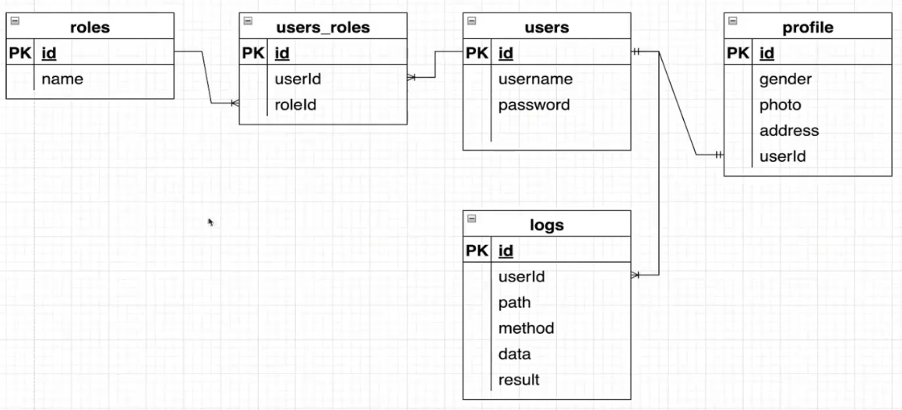

# 01. 解决 CRLF 换行报错

- 创建新项目时，会报错 `Delete ␍ eslintprettier/prettier`

```js
// 在 .prettierrc 文件中加入如下代码
"endOfLine": "auto"

// 在 eslint.config.mjs 文件中加入如下代码
rules: {
	'prettier/prettier': ['error', { endOfLine: 'auto' }],
}
```

# 02. 多环境配置

## 2.1 [dotenv 库 ](https://www.npmjs.com/package/dotenv) & @nestjs/config

- **理解**：`dotenv` 库是一个非常流行的用于在 Node.js 环境中加载环境变量的工具。通过将敏感的配置信息（如数据库连接字符串、API 密钥等）保存在 `.env` 文件中，可以方便地在不同的开发环境和生产环境中进行配置管理。
- **核心功能**：将 `.env` 文件中的变量加载到 `process.env` 中，以便可以在代码中访问这些变量。
- **@nestjs/config 模块**：NestJs 官方的 Config 模块采用的是 dotenv 库。

```ts
pnpm i --save @nestjs/config // 安装模块
pnpm i -D cross-env // 用于设置 NODE_ENV 运行环境
pnpm i dotenv // 在 nestjs 中安装这个库，用于解析 .env 公共配置文件

// ----------------------- app.module.ts 文件：读取多个 .env 文件 -------------------------
// 根据 NODE_ENV 读取开发环境或生产环境的 .env 文件。其中，NODE_ENV 由 cross-env 库在 package.json 文件中设置。
const envFilePath = `.env.${process.env.NODE_ENV || 'development'}`;
@Module({
  imports: [     
    ConfigModule.forRoot({ // ConfigModule.forRoot() 方法用于读取 env 文件
      isGlobal: true, // ConfigModule 可以在所有模块中使用。注意，在其他模块中使用时需要导入 ConfigService。
      envFilePath, // 读取开发环境或生产环境的 .env 文件
      // 加载 .env 公共配置文件（与其他两个 .env 文件产生关联），并且使用 dotenv 库解析该文件(返回一个对象)。
      load: [() => dotenv.config({ path: '.env' })], // load 方法用于加载自定义的配置文件。
    }),
    ... ...
  ],
  ... ...
})
      
// 获取环境变量
console.log('DB: ', this.configService.get(configEnum.DB)); // 获取配置文件中的环境变量
```

- `ConfigModule.forRoot({ load：[xxx] })`：load 配置项可以用于加载自定义的配置文件。`.env` 文件在处理多层级的环境变量时会出现**变量名过长**的问题，比如 `db_mysql_port=xxx`。因此，可以使用 load 配置项读取 `yaml` 自定义文件，该类型文件主要处理**多层嵌套的环境变量**。
- **注意**：需要使用 lodash 库中的 merge 方法手动**深度合并**公共配置和特定环境的配置。

```ts
pnpm i js-yaml // 对 yaml 文件进行解析的库，会返回一个对象
pnpm i -D @types/js-yaml // js-yaml 文件的类型声明

// ------------ projectRoot/config/config.yaml 文件 -------------
db:
  mysql1:
    host: 127.0.0.1
    name: mysql-dev1
    port: 3306
  mysql2:
    host: 127.0.0.1
    name: mysql-dev2
    port: 3306

// ------------- src/configuration.ts 文件用于读取 yaml 环境变量配置文件 -------------
import { readFileSync } from 'fs';
import * as yaml from 'js-yaml';
import { join } from 'path';
const YAML_CONFIG_FILENAME = 'config.yaml';
const filePath = join(__dirname, '../config', YAML_CONFIG_FILENAME);
export default () => { // 导出一个函数是为了在 app.module.ts 中的 load 配置项中使用 
  return yaml.load(readFileSync(filePath, 'utf8'));  // 使用 yaml.laod 解析 yaml 文件，并返回一个对象
};

// ---------------------- 分开开发环境和生产环境的变量 ----------------------
pnpm i lodash // 使用 lodash 中的 merge 方法实现深度合并
pnpm i --save-dev @types/lodash
// 创建 config.development.yaml 文件和 config.production.yaml 文件
// 读取公共环境变量的 yaml 文件
const YAML_COMMON_CONFIG = 'config.yaml';
const commonPath = join(__dirname, '../config', YAML_COMMON_CONFIG);
const commonConfig = yaml.load(readFileSync(commonPath, 'utf8'));

// 根据 NODE_ENV 变量的值决定读取开发环境还是生产环境的 yaml 文件
const YAML_ENV_CONFIG = `config.${process.env.NODE_ENV || 'development'}.yaml`;
const envPath = join(__dirname, '../config', YAML_ENV_CONFIG);
const envConfig = yaml.load(readFileSync(envPath, 'utf8'));

// 导出一个函数是为了在 app.module.ts 中的 load 配置项中使用
export default (): Record<string, any> => {
  // 使用 lodash 的 merge 方法将公共配置和当前环境配置合并成一个新的配置对象(深度合并)
  return _.merge(commonConfig, envConfig) as Record<string, any>;
};
```

## 2.2 [config 库](https://www.npmjs.com/package/config)

- **理解**：`config` 库核心思想是将应用的配置信息从代码中分离出来，允许不同的配置根据运行的环境（如开发、生产、测试等）进行管理和加载。
- **特点**：`config` 库支持配置项的**层级结构**，可以将多个配置项组织成一个嵌套对象。
- **优点**：可以**自动读取**公共配置并**合并**特定环境的配置。当配置发生冲突时，特定环境的配置会**覆盖**公共配置。**不需要手动进行配置**就能读取环境变量，非常方便。
- **使用场景**：它通常用于中大型项目，尤其是当应用有多个配置项并且需要在不同环境中灵活配置时。

```ts
// 配置文件结构
project/
├── config/
│   ├── default.json        // 默认配置
│   ├── production.json     // 生产环境配置
│   ├── development.json    // 开发环境配置
│   └── test.json           // 测试环境配置
├── app.js
└── package.json

// 配置嵌套对象
{
  "db": { "credentials": { "user": "admin", }  }
}

// 使用 config 库来加载和访问这些配置项
const config = require('config'); // 导入 config 库
const dbUser = config.get('db.credentials.user'); // 可以在任何地方使用这个方法
console.log(dbUser); // 输出：admin
```

## 2.3 校验环境变量 & [Joi 库](https://joi.dev/api/?v=17.13.3)

- **理解**：使用 Joi 库校验配置文件时，最好配合官方的 `@nestjs/config` 读取 `.env` 文件时使用。

```ts
ConfigModule.forRoot({
  isGlobal: true, // ConfigModule 可以在所有模块中使用。注意，在其他模块中使用时需要导入 ConfigService。
  envFilePath, // 读取开发环境或生产环境的 .env 文件
  // 加载 .env 公共配置文件（与其他两个 .env 文件产生关联），并且使用 dotenv 库解析该文件(返回一个对象)。
  load: [() => dotenv.config({ path: '.env' })], // load 方法用于加载自定义的配置文件。
  // Joi 最好配合官方的 @nestjs/config 读取 .env 文件时使用。
  validationSchema: Joi.object({
    // DB_PORT: Joi.number().default(3306), // 设置环境变量的默认值
    DB_PORT: Joi.number().valid(3306, 3308), // 校验环境变量的值，限制端口号的范围
    NODE_ENV: Joi.string().valid('development', 'production', 'test'),
  }),
}),
```

#  03. TypeORM 库

## 3.1 必备依赖包

- **@nestjs/typeorm 库**：NestJS 官方提供的 TypeORM **集成**模块，用于搭建 NestJs 和 TypeORM 之间的桥梁。它使用 TypeORM 库来操作数据库，但是它本身**并不包含 TypeORM 的代码**，所以必须显式安装 `typeorm` 才能正常运行 `@nestjs/typeorm` 提供的功能。该库能让你在 NestJS 中使用依赖注入（DI）方式来配置和操作数据库。
- **typeorm 库**：TypeORM 是一个流行的 TypeScript ORM（对象关系映射）库。

- **mysql2 库**：MySQL 的 Node.js 客户端库（驱动），它是**真正操作数据库**的库。与原始的 `mysql` 包相比，`mysql2` 更快，兼容性更好，支持 Promise 和 async/await。TypeORM 在底层是通过它来实际发起数据库连接和执行查询的。

```bash
pnpm i --save @nestjs/typeorm typeorm mysql2 # 安装依赖包
```

## 3.2 使用 docker 运行 MySQL

```yaml
# ---------------------- docker-compose.yml 配置文件 --------------------
services:
  db:
    image: mysql
    restart: always
    environment:
      MYSQL_ROOT_PASSWORD: example # 密码
      MYSQL_DATABASE: testdb # 创建数据库。只在首次创建 testdb 数据库时生效。
    ports:
      - "3307:3306"  # 映射到宿主机的3307端口（3306 端口被占用）

  # mysql 的管理工具：通过 localhost:8080 网站访问 mysql 图像化界面
  adminer:
    image: adminer
    restart: always
    ports:
      - 8080:8080

# 使用命令行运行 docker 中的 mysql 数据库
docker-compose up -d # -d 表示在后台运行
```

## 3.3 连接数据库

- **ormconfig.ts 文件**：该文件中提取了核心配置文件，所有数据库相关的配置都在这里管理。该文件支持 TypeORM CLI 和统一管理，在迁移数据库的过程中发挥重要作用。

``` ts
// 1. 数据写死配置方式 - forRoot 方法
TypeOrmModule.forRoot({
  type: 'mysql',
  host: 'localhost',
  port: 3307, // 端口号，查看 docker-compose.yml 配置文件
  username: 'root',
  password: 'example',
  database: 'testdb', // 指定要连接的数据库名称，mysql 中必须需要有这个数据库
  entities: [],
  // 同步本地实体与数据库中的表结构，一般会在初始化时使用。注意，仅在开发环境使用。
  synchronize: process.env.NODE_ENV === 'development', 
  logging: ['error'],
}),
    
// 2. 使用 configService 读取环境变量来配置数据库，可以使用泛型来限制配置类型(也可以配合 Joi 使用) - forRootAsync 方法
TypeOrmModule.forRootAsync({
  imports: [ConfigModule],
  inject: [ConfigService],
  useFactory: (configService: ConfigService) => {
    return {
      type: configService.get<'mysql' | 'mariadb'>(configEnum.DB_TYPE),
      host: configService.get<string>(configEnum.DB_HOST),
      port: configService.get<number>(configEnum.DB_PORT),
      username: configService.get<string>(configEnum.DB_USERNAME),
      password: configService.get<string>(configEnum.DB_PASSWORD),
      database: configService.get<string>(configEnum.DB_DATABASE), // 指定要连接的数据库名称，在 mysql 中必须存在。
      entities: [User, Profile, Logs, Roles], // 实体类，对应数据库表
      // 同步本地实体与数据库中的表结构，一般会在初始化时使用。注意，仅在开发环境使用。
      synchronize: process.env.NODE_ENV === 'development', 
      // logging: ['error'],
      logging: process.env.NODE_ENV === 'development', // 打印所有的 SQL 语句，一般只在开发环境下使用
    };
  },
}),
```

## 3.4 实体类 -> 创建数据库表

- **Reference**: [TypeORM 中文文档 - 关联关系](https://typeorm.bootcss.com/relations)



### 3.4.1 一对一

- **外键字段存放位置**：一个 User 拥有一个 Profile，外键字段存放于**”被拥有“**的表中。

```ts
// --------------------- todo: Profile 表设置一对一的关联关系（设置外键） ---------------------
@Entity()
export class Profile {
  ... ...
  // 建立一对一依赖关系
  @OneToOne(() => User) // 返回依赖的实体类（数据表）。返回函数形式可以避免循环依赖问题，延迟加载实体类型
  @JoinColumn() // 创建关联字段（外键字段）。默认通过 userId 字段名关联 user 表。
  // @JoinColumn({ name: 'uid' }) // 可以使用 name 属性自定义关联字段名称。
  user: User; // 通过 user 属性可以访问关联的 User 对象的所有数据
}

// --------------------- todo: User 表设置一对一的关联关系（设置外键） ---------------------
// 一对一关系：一个用户拥有一个个人资料
@OneToOne(() => Profile, (profile) => profile.user)
profile: Profile;
```

### 3.4.2 一对多 & 多对一

- **外键字段存放位置**：存放于”多“的一方。User 拥有多个 Logs，外键字段存放于**”被拥有“**的一方。

```ts
// --------------------- todo: User 表设置一对多的关联关系 ---------------------
@Entity()
export class User {
  ... ...
  // 一对多关系：一个用户拥有多个日志，会在"被拥有"的表中创建外键字段。
  // 第二个参数解析：表示从 A 实体如何找到 B 实体中对应的关联属性。当我从 User 查找关联的 Logs 时，通过 Logs 实体中的 user 属性来建立反向连接
  @OneToMany(() => Logs, (logs) => logs.user)
  logs: Logs[]; // 数组类型，表示多个日志
}

// --------------------- todo: Logs 表设置多对一的关联关系 ---------------------
@Entity()
export class Logs {
  ... ...
  // 多对一关系：多个日志对应一个用户
  @ManyToOne(() => User, (user) => user.logs)
  @JoinColumn() // 指定关联字段，默认值为 userId。注意，在 Logs 表（"多"的一方）中需要创建外键字段。
  user: User;
}
```

### 3.4.3 多对多

```ts
// --------------------- todo: User 表设置多对多的关联关系 ---------------------
@Entity()
export class User {
  ... ...
  // 多对多关系：一个用户拥有多个角色，一个角色对应多个用户
  @ManyToMany(() => Roles, (roles) => roles.users)
  @JoinTable({ name: 'users_roles' }) // 建立多对多关联的中间表，表名命名为 user_roles
  roles: Roles[];
}

// --------------------- todo: Roles 表设置多对多的关联关系 ---------------------
@Entity()
export class Roles {
  ... ...
  @ManyToMany(() => User, (user) => user.roles)
  users: User[];
}
```

## 3.5 数据库表 -> 创建实体类

- **Reference**: [使用 typeorm-model-generator 库](https://www.npmjs.com/package/typeorm-model-generator)   |   [B 站视频](https://www.bilibili.com/video/BV14fDGYUEip?spm_id_from=333.788.videopod.episodes&vd_source=53fdd342b8b1677425cdb446eb231b76&p=54)

```ts
pnpm i -D typeorm-model-generator // 仅安装开发依赖
```

# 04. NestJs 实现 CURD

## 4.1 基本的 CURD 操作

```ts
// --------------------- todo: 在 user.module.ts 文件中将实体注册到当前模块 ---------------------
@Module({
  // 将 User 实体注册到当前模块。然后，NestJS 会自动创建 UserRepository（用于操作 User 表的工具），可以在 Service 中通过依赖注入使用。
  imports: [TypeOrmModule.forFeature([User])],
  controllers: [UserController],
  providers: [UserService],
})
export class UserModule {}

// --------------------- todo: 在 user.service.ts 文件中使用 UserRepository ---------------------
@Injectable()
export class UserService {
  constructor(
    // 使用 @InjectRepository() 装饰器将 UsersRepository（用于操作 User 表的工具）注入到 UsersService 中
    @InjectRepository(User)
    private readonly userRepository: Repository<User>,
  ) {}

  findAll() { return this.userRepository.find(); }   // 查询所有数据
  find(username: string) { return this.userRepository.findOne({ where: { username } }); } // 根据条件进行查询
  remove(id: number) { return this.userRepository.delete(id); } // 删除某个 User 数据
    
  // 创建新的 User 数据
  create(user: User) {
    const userTemp = this.userRepository.create(user);
    return this.userRepository.save(userTemp);
  }
    
  // 更新用户时只需要提供要修改的字段, Partial<User> 表示 User 对象的部分属性，即所有属性都变成可选的。
  // update 方法需要传递查询的参数，以及更新后的 User 类型的对象
  update(id: number, user: Partial<User>) { return this.userRepository.update(id, user); }
    
  // todo: 实现一对一的关联查询
  findProfile(userId: number) {
    return this.userRepository.findOne({
      where: { id: userId },
      relations: { profile: true }, // 开启关联查询
    });
  }

  // todo: 实现一对多的关联查询，查询某个用户拥有的所有日志信息
  findUserLogs(userId: number) {
    return this.userRepository.findOne({
      where: { id: userId },
      relations: { logs: true }, // 开启关联查询
    });
  }
}
```

## 4.2 Query Builder & 复杂查询

```ts
// todo: 使用 Query Builder 查询 userId 为 2 的用户拥有的 logs 信息的 result 数据和相同的 result 出现的次数
findLogsByGoup(userId: number) {
  /*
  SQL: 
  	SELECT logs.result as result, COUNT(logs.result) as count
  	from logs
  	LEFT JOIN user ON user.id = logs.userId
  	WHERE user.id = 2 
  	GROUP BY logs.result
  */
  return (
    this.logsRepository
      .createQueryBuilder('logs') // 'logs' 是为主表(Logs 表)设置的别名
      .select('logs.result', 'result') // 选择 logs 表的 result 字段
      .addSelect('COUNT(logs.result)', 'count') // 第二参数是字段别名
      // 左连接 user 表，并选择 user 表的所有字段。'user' 是连接表的别名。注意，AndSelect 后缀会选择 user 表的所有字段
      .leftJoinAndSelect('logs.user', 'user')
      .where('user.id = :id', { id: userId })
      .groupBy('logs.result')
      .orderBy('result', 'DESC')
      .getRawMany()
  );
}
```

# 05. 日志

| **日志等级** | **理解**                                         |
| ------------ | ------------------------------------------------ |
| Log          | 通用日志，按需进行记录（打印）。                 |
| Warning      | 警告日志，比如：尝试多次进行数据库操作。         |
| Error        | 严重日志，比如：数据库异常。                     |
| Debug        | 调试日志，比如：加载数据日志。                   |
| Verbose      | 详细日志，所有的操作与详细信息（非必要不打印）。 |

| **日志分类** | **理解**                         |
| ------------ | -------------------------------- |
| 错误日志     | 方便定位问题，给用户友好的提示。 |
| 调试日志     | 方便开发。                       |
| 请求日志     | 记录敏感行为。                   |

|          |   Log   |  Warning  |     Error      |     Debug      | Verbose |     API      |
| :------: | :-----: | :-------: | :------------: | :------------: | :-----: | :----------: |
| **Dev**  |    √    |     √     |       √        |       √        |    √    |      ×       |
| **Test** |    √    |     √     |       √        |       ×        |    ×    |      ×       |
| **Prod** |    √    |     √     |       ×        |       ×        |    ×    |      √       |
| **位置** | console | File / DB | console / File | console / File | console | console / DB |

## 5.1 NestJs 内置日志模块

```ts
// -------------------------- 在 main.ts 文件中全局使用 --------------------------
async function bootstrap() {
  const app = await NestFactory.create(AppModule, {
    logger: false, // 关闭整个 NestJs 的日志
    logger: ['error', 'warn'], // 指定需要打印的日志等级
  });
  await app.listen(process.env.PORT ?? 3000);
  // 创建日志实例，并输出 warn 等级的日志
  const logger = new Logger(); // 创建一个日志实例
  logger.log(`Application is running on: 3000 --- log level`); // 绿色
  logger.warn(`Application is running on: 3000 --- warn level`); // 橙色
}

// ------------------- 在 user.controller.ts 文件中进行局部使用 -------------------
@Controller('user')
export class UserController {
  // 实例化日志对象(不要使用依赖注入)，参数为当前 controller 的名称，用于区别日志
  private userLogger = new Logger(UserController.name);
  constructor(... ...) {    
    this.userLogger.log('user.controller: Init'); // 测试 userLogger
  }

  @Get()
  getUsers(): any {
    this.userLogger.log('请求 getUsers 成功'); // 测试 userLogger
    ... ...
  }
}
```

## 5.2 第三方日志模块

- [Github - Pino 日志模块](https://github.com/pinojs/pino/blob/main/docs/web.md#nest)   |   [npm - Pino 日志模块](https://www.npmjs.com/package/nestjs-pino)   |   [Bilibili - Pino 日志模块](https://www.bilibili.com/video/BV14fDGYUEip?spm_id_from=333.788.player.switch&vd_source=53fdd342b8b1677425cdb446eb231b76&p=61)
- Winston 日志

# 06. 异常过滤器

- **Reference**: [NestJs 中文网 - 异常过滤器](https://nest.nodejs.cn/exception-filters)   |   [NestJs 中文网 - 内置 HTTP 异常](https://docs.nestjs.cn/11/exceptionfilters?id=%e5%86%85%e7%bd%aehttp%e5%bc%82%e5%b8%b8)

- **理解**：Nest 带有一个内置的异常层，负责处理应用中所有未处理的异常。当你的应用代码未处理异常时，该层会捕获该异常，然后自动发送适当的用户友好响应。

```ts
// --------------------------- user.controller.ts 文件 ------------------------------
if (!isAdmin) throw new HttpException('用户禁止访问', HttpStatus.FORBIDDEN); // 403
if (!isAdmin) throw new HttpException('用户不存在', HttpStatus.NOT_FOUND); // 自动设置状态码 404
if (!isAdmin) throw new UnauthorizedException('用户没有权限'); // 自动设置状态码 401
```

## 6.1 捕获全局异常

- **Filter 文件**：可以通过 Nest CLI 工具创建 filter 类型的文件。
- **注意**：全局的异常过滤器**只能有一个**。

```ts

// ----------------------------- main.ts 文件 ------------------------------
... ...
const logger = new Logger(); // 创建一个日志实例
// 全局注册过滤器，结合错误日志使用。注意，全局过滤器只能有一个。
app.useGlobalFilters(new HttpExceptionFilter(logger));
await app.listen(process.env.PORT ?? 3000);

// ------------ src/filters/http-exception.filter.ts 文件：定义全局的异常过滤器 --------------
import type { Request, Response } from 'express';

@Catch(HttpException) // 指定这个过滤器只捕获 HttpException 类型的异常
export class HttpExceptionFilter implements ExceptionFilter {
  constructor(private logger: Logger) {} // 异常处理结合日志，会在控制台输出异常

  // 实现 ExceptionFilter 接口中的 catch 方法。
  // ArgumentsHost: 提供对当前执行上下文的访问，可以获取 Request、Response 对象。
  catch(exception: HttpException, host: ArgumentsHost) {
    const ctx = host.switchToHttp(); // 获取上下文对象
    const request = ctx.getRequest<Request>(); // 获取请求对象
    const response = ctx.getResponse<Response>(); // 获取响应对象
    const status = exception.getStatus(); // 获取状态码
    this.logger.error(exception.message, exception.stack); // 错误日志

    // 定义响应数据
    response.status(status).json({
      statusCode: status,
      timestamp: new Date().toISOString(),
      path: request.url,
      method: request.method,
      // NotFoundException('用户不存在') 中的参数会作为 message 的值
      message: exception.message || HttpException.name, 
    });
  }
}
```

